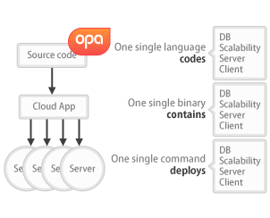

Introducing Opa
---------------

This is a great time to be a developer: As a community, we are
changing the world, every day, thanks to the web, the cloud and their
myriads of applications. Web applications and technologies available
to developers have evolved tremendously since the first days of the
web.

Opa is a new generation of web development platform that lets you
write distributed web applications using a single technology.
Throughout the pages of this book, we will introduce you to the
many features of Opa. To quote but a few, Opa is concise, simple,
concurrent, dynamically distributed, and secure.

What problem does Opa solve?
~~~~~~~~~~~~~~~~~~~~~~~~~~~~

The web is evolving at a very fast pace. Unfortunately, the _process_
of web application development has evolved neither quite as far, nor
nearly as fast. Indeed, developing a web application in 2011 is not so
different from developing a PC application in 1991: an impressive
amount of developer time is spent not working on features or
improvements but on _gluing_ together antagonist technologies that
were never designed to work together or in this context. In 1991, the
technologies were the various hardware components, the low-level
operating system, the high-level operating system and the memory
itself, which could only be hacked into compliance through copious
amounts of machine code. Per se, none of these technologies was wrong,
but they just failed to fit together -- a problem now known as
_impedance mismatch_.

Today, the technologies involved include the various incompatible
browsers, the server components or the database components, to quote
but a few. As in 1991, none of these technologies is wrong, but they
do not fit together. Because of this impedance mismatch, developers
need to add to their application logic copious amounts of glue code
just to get the components to agree on communication mechanisms and
application-level protocols. Not only is this glue code tedious,
repetitive and error-prone, but this is also where most safety and
security issues arise.

In 1991, the answer to impedance mismatch was Software Development
Kits, and indeed these SDKs proved very useful at allowing developers
to develop anything at all, but failed to address the underlying
issues. This was only achieved later, through better operating
systems, better development tools, and resulted in today's Java
Platform, C#, Objective-C or Python, for instance. 

In 2011, web frameworks, both client-side and server-side, have the
same role as the SDKs of the 1991s, with the same success but also the
same shortcomings. But the problem remains: Building web applications
is hackish, relies on glue code and is barely reusable.

How Opa solves it
~~~~~~~~~~~~~~~~~

With Opa, we set out to provide another, better, way of developing web
applications for the cloud. Opa is designed to get you to your
finished app faster, concentrating only on the interesting parts,
without the hassle of writing the glue or of using a programming
language against its original design; also without having to keep such
a constant watch on low-level security issues.

Opa is a programming language and a standard library comprising a
database management system, a web server, a server-side framework, a
client-side framework, a distribution middleware, a security audit
tool, but without the complexity of deployment, administration, or
impedance mismatch stemming from the use of many different
technologies.

Developing with Opa is as simple as it gets: First, write your code
with the Opa programming language -- and only the Opa programming
language, no JavaScript, no SQL, or anything such. Then compile the
code, and let Opa analyze security, generate the code for the browser,
for the server, for the database, and combine it with the web
server. Finally, launch your executable and every browser, including
mobile, can connect to your application.  There is need to
independently deploy, administer or maintain a database management
system, a web server, frameworks or middleware. If you have lots of
users, deploying in the cloud is just a command away.

Simply put, Opa is a programming language and its runtime,
designed to carry web developers from start to finish of their development,
from early prototype to seamless deployment.

What Opa is not
~~~~~~~~~~~~~~~

While Opa offers all the features that developers have come to expect
from a high-end web server, a high-end distributed database management
system, frameworks or distribution engine, Opa does _not_ resemble
Apache or Tomcat, MySQL or Oracle SQL, Drupal or Ruby on Rails, Google
AppEngine or Hadoop.  With some effort, Opa could certainly be used to
mimic some of these components, but that is not how or why Opa was
designed.

To this day, Opa does not offer a command-line database interface, or
mechanisms to serve web pages from the file system. Opa is probably
not well suited for writing embedded or desktop applications or
anything else which does not run in the web.

What is it good for?
~~~~~~~~~~~~~~~~~~~~

Opa was designed for all users, beginners or seasoned developers, students or
professionals, but not for all applications.

Indeed, Opa was built from the bottom-up for _cloud_ applications, and
shines most with applications that require scalability, security,
interactivity, real-time web and complex data manipulation.

Think of a social application. Numerous users communicating in
real-time by chat, e-mail, forums or other means, through a rich user
interface, but also through web services that can be accessed by
third-party websites or native mobile interfaces. Perhaps these users
can even modify shared appointment tables or work on some documents
together. Developers need to combine complex information sources,
extract the results quickly and get them back to the user in
real-time. As the number of users grows, servers must be added, both
to store large amounts of data, to manipulate it, and to respond
quickly to end-users.

Out of the box, Opa features scalable storage, heavily
concurrent/distributed manipulation of data, service-oriented API and
load-balanced web serving. Even better, as social applications
commonly require considerable computing power, the computing
performance of Opa ensures that fewer machines are required to handle
crowds than would be required with other development solutions.

Or think of an e-Commerce store. Highly dynamic web pages, generated
constantly from the database, and a user experience that may need to
be altered quickly and without disrupting the flow, to match holiday
seasons or ongoing ad campaigns, but also a base of orders that needs
to be kept secure from would-be intruders, and safe from accidents,
including hardware failures.

Opa is also great for this kind of applications. Its content
management engine is second to none, whether in flexibility, power or
security. Opa's built-in security checks guarantee that the
application will resist most attacks, while the replicated and
versioned database ensures that you can always rollback to previous
data or recover from outages.

We have used Opa to build social networks, e-Commerce applications,
but also multiplayer web games, communication tools,
developer-oriented tools -- and of course the CMS behind
http://opalang.org[our website].

A first peek at Opa
~~~~~~~~~~~~~~~~~~~

The rest of the book will introduce you in all details to Opa, but let us take
a sneak peek preview and take a look at the simplest application: Hello, web.

[source, opa]
------------------------
server = one_page_server("Hello", -> <>Hello, web!</>)
------------------------

This is the full source code of the application. Without any setup (besides the
installation of the compiler), obtaining a complete, deployable application is
only a matter of one step:

----------------
opa hello_web.opa
----------------

This command produces a stand-alone executable binary, containing
everything required for execution, including database management, compiled
requests, server code, client code, user interface and everything that may be
needed to connect them or to handle malicious connections or inputs. Opa generated
and checked all this code for you. You may now launch the server:

----------------
./hello_web.exe
----------------

Or, if you prefer, you may deploy it to a cloud:

----------------
opa-cloud hello_web.exe --host localhost --host my@my_server1 --host my@my_server2
----------------

Your application is launched, load-balanced, and servers share whichever information
is necessary.

//Welcome to Opa. It really is that simple.

Summary
~~~~~~~

In the following chapters, we will introduce you to the various features and
use-cases of Opa. Each chapter concentrates on writing one specific application, and
on how best to achieve this using combinations of skills developed in previous and
current chapter. At the end of the book, additional reference chapters recapitulate
in detail all the concepts of the language and the platform.

This book assumes some knowledge of programming (any language should do) and web
pages (knowledge of HTML and CSS will be useful). Any additional knowledge of
web applications will let you understand better how much Opa makes development
_right_.

Getting in touch
~~~~~~~~~~~~~~~~
If you have any question or feedback, do not hesitate to contact us.

A few ways to get in touch:

- Opa https://lists.owasp.org/mailman/listinfo/opa[mailing list];
- http://stackoverflow.com/questions/tagged/opa[Stack Overflow], an excellent site for seeking
  help with programming problems (do not forget to mark Opa related questions with
  the ``Opa'' tag);
- through http://twitter.com/opalang[Twitter], as opalang.

We will be there!
